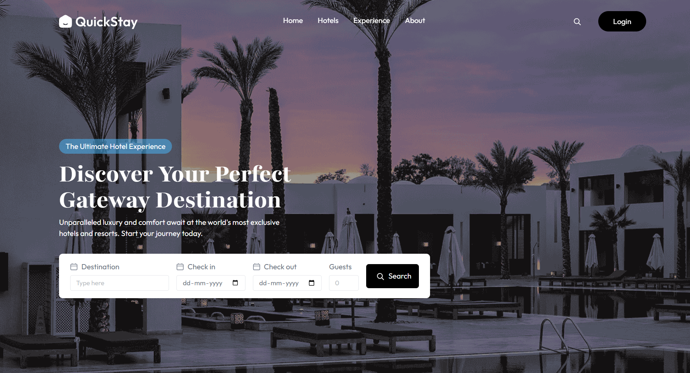
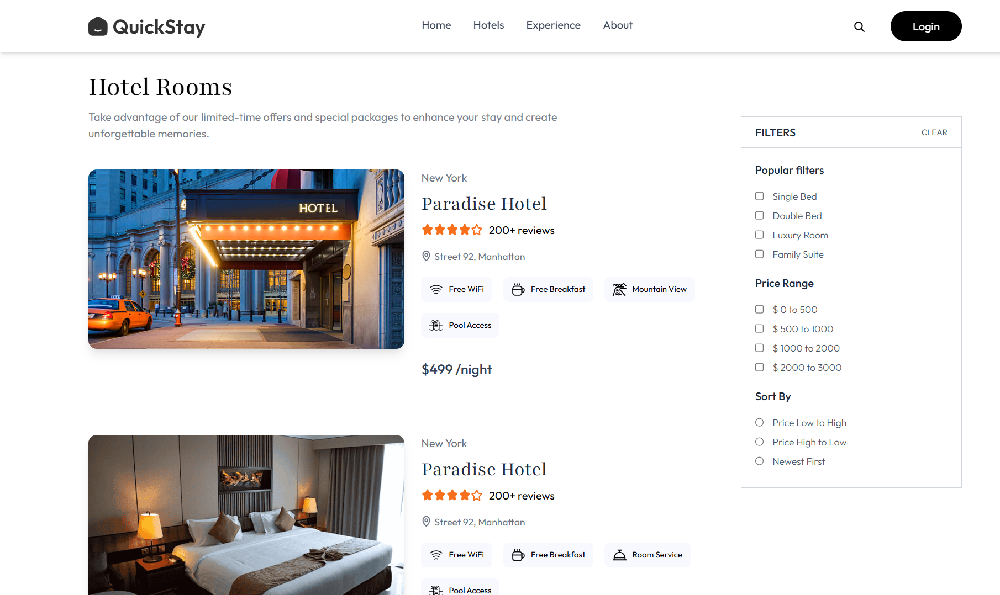
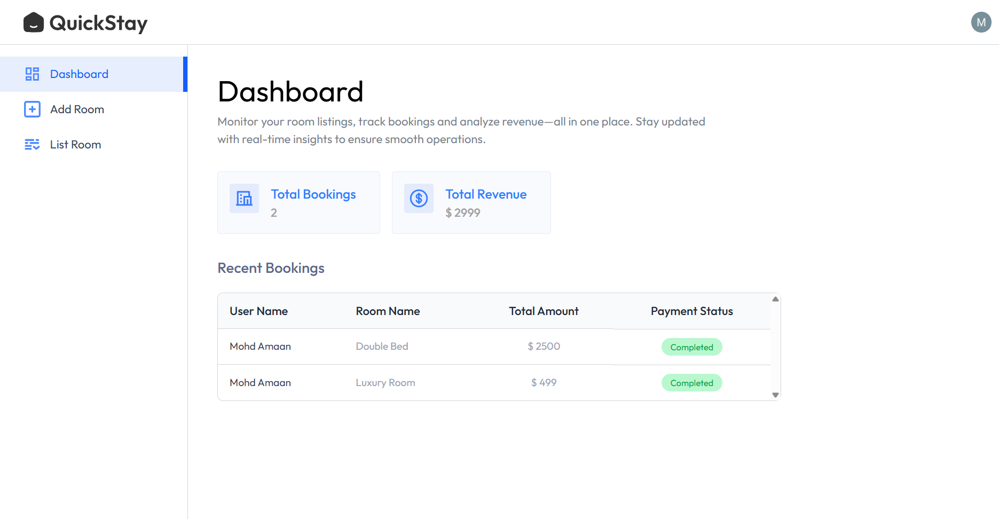
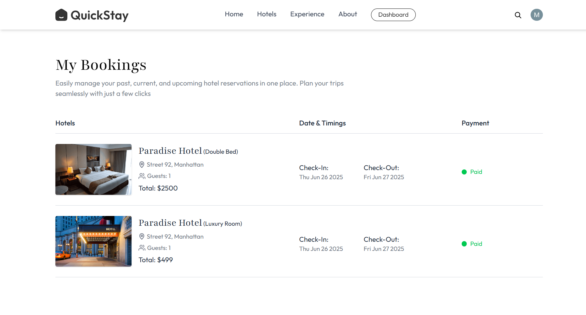

QuickStay – Next-Gen Hotel Booking Platform

QuickStay is a full-stack hotel booking solution built with the MERN stack.
It provides travelers with a smooth booking experience and empowers hotel owners with modern property management tools. With secure payments, real-time availability, and a responsive design, QuickStay is designed to mimic production-ready travel platforms.

✨ Core Highlights
👤 For Travelers

🔍 Hotel Discovery – Browse rich listings with images, descriptions, and amenities

📅 Live Availability – Real-time room availability and instant booking confirmation

💳 Secure Payments – Stripe integration ensures safe and fast checkouts

📧 Email Notifications – Automated booking confirmation via Brevo

📱 Responsive Experience – Optimized for mobile, tablet, and desktop

🏢 For Hotel Owners

🏨 Property Management – Easily add, edit, and remove rooms/properties

📊 Revenue Dashboard – Visualize earnings and booking trends at a glance

🔄 Instant Updates – Manage availability and sync changes in real time

📸 Photo Hosting – Upload and manage images seamlessly with Cloudinary

🛠 Tech Stack
Category	Technologies
Frontend	React (Vite), TailwindCSS
Backend	Node.js, Express.js
Database	MongoDB + Mongoose
Authentication	Clerk
Payments	Stripe
Emails	Brevo (Sendinblue)
Media Storage	Cloudinary
Hosting	Vercel (Frontend + Serverless Backend)
Monitoring	Vercel Analytics, Speed Insights
📸 Screenshots
🏠 Homepage – Explore Hotels

  

🛏️ Room Booking – Simple & Secure

  

📊 Owner Dashboard – Control Panel

  

📖 Booking History – Stay Organized

  

🚀 Why QuickStay?

✅ Real SaaS-like experience – mimics production travel apps

✅ End-to-end architecture – from frontend to payments to analytics

✅ Secure by design – Auth (Clerk) + Payments (Stripe) + Cloud storage

✅ Scalable backend – Built with Express and MongoDB for flexibility

✅ Beautiful UI/UX – Responsive TailwindCSS design with modern workflows

⚡ Getting Started

Clone the repo and install dependencies:

# Clone repository
git clone https://github.com/your-username/Hotel_Booking_Webapp.git
cd Hotel_Booking_Webapp

🔧 Setup
# Client setup
cd client
npm install
npm run dev

# Server setup
cd ../server
npm install
npm run dev

🔑 Environment Variables

Create a .env file for both client and server with:

MONGODB_URI – MongoDB connection string

CLERK_SECRET_KEY – Clerk authentication key

STRIPE_SECRET_KEY – Stripe private key

BREVO_API_KEY – For email notifications

CLOUDINARY_URL – For media uploads

⚠️ Disclaimer

This is a portfolio project created for educational and demonstration purposes.
It does not process real payments or bookings
